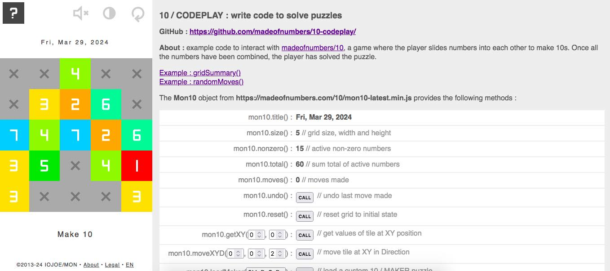

# 10 / CODEPLAY : write code to solve puzzles

## About 
Example code to interact with [madeofnumbers/10](https://madeofnumbers.com/10/), a game where the player slides numbers into each other to make 10s. Once all the numbers have been combined, the player has solved the puzzle.

> Examples demo : https://madeofnumbers.com/10/codeplay/

 

---

### Examples of Mon10 object methods

See: [examples demo](https://madeofnumbers.com/10/codeplay/)

---

### Example : gridSummary()

Uses **mon10.getXY()** to build a simple summary of the current grid state, including positions of tiles grouped by value.

Script: [mon10-codeplay-example-grid-summary.js](https://github.com/madeofnumbers/10-codeplay/blob/main/examples/grid-summary/mon10-codeplay-example-grid-summary.js)

---

### Example : randomMoves()

Uses **mon10.getXY()**, **mon10.moveXYD()**, **mon10.nonzero()** and **mon10.size()** to make entirely random moves with almost no chance of solving a puzzle.

Script: [mon10-codeplay-example-random-moves.js](https://github.com/madeofnumbers/10-codeplay/blob/main/examples/random-moves/mon10-codeplay-example-random-moves.js)

---

The puzzle game 'madeofnumbers/10' and its editor '10 / MAKER' are ©2024 IOJOE / madeofnumbers. All rights reserved.

'10 / CODEPLAY' examples are open-source under the MIT license ©2024 madeofnumbers